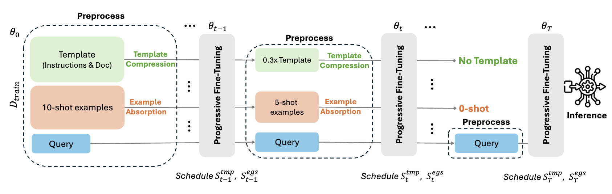

# PromptIntern: Saving Inference Costs by Internalizing Recurrent Prompts

[](https://arxiv.org/abs/2407.02211)

Official implementation of our EMNLP 2024 Paper **"PromptIntern: Saving Inference Costs by Internalizing Recurrent Prompt during Large Language Model Fine-tuning"**.

## 🔔 News 
**[09.17.2025]** We have open-sourced our code implementation for **[PromptIntern](https://arxiv.org/abs/2407.02211)**!

**[09.18.2024]** PromptIntern has been accepted to EMNLP 2024!


## 📖 Overview
<p align="center">
  
</p>

Fine-tuning large language models (LLMs) often relies on long prompts with repeated templates and few-shot examples. This increases:

- **Inference cost**  
- **Latency**  
- **Token consumption**

**PromptIntern** addresses this by *internalizing* prompt knowledge into model parameters during fine-tuning. Instead of repeatedly feeding templates and examples at inference time, PromptIntern progressively absorbs them, enabling **query-only inference**.


**Key ideas:**
- **Template Compression** – progressively reduce redundant instruction/doc tokens.  
- **Example Absorption** – integrate few-shot examples into model parameters.  
- **Progressive Fine-tuning** – a scheduled pipeline to internalize prompts gradually.  


## 🚀 Highlights

**Efficiency**:  
  - ↓ **90%+ fewer input tokens**  
  - ↑ **4.2× faster inference**  
  - ↓ **88.3% lower inference cost**  

**Effectiveness**:  
  - Comparable or better accuracy vs. direct fine-tuning.  
  - Outperforms state-of-the-art prompt compression methods across NL2Code benchmarks.  

**Broad Applicability**: Works with both **open-source** (Llama 2, Mixtral) and **closed-source** (GPT-3.5, GPT-4) models.  


## 📊 Results

### Comparison with Prompt Compression Baselines

| Method            | MBPP Pass@1 | NL2F E.M. | NL2Bash BLEU |
|-------------------|-------------|-----------|--------------|
| GPT-4 Generation  | 61.8        | 59.6      | 59.5         |
| LLMLingua-2       | 72.5        | 70.4      | 62.8         |
| **PromptIntern**  | **78.1**    | **81.4**  | **70.5**     |

### Efficiency Gains

- **Token usage**: up to **12× reduction**  
- **Latency**: competitive with query-only inference  
- **Cost**: **~88% savings** compared to baseline prompting  


## 🔧 Usage

### 1. Training Data Preparation
We evaluate on **NL2Code benchmarks**:
- MBPP
- NL2F
- NL2Bash

Generated Python is evaluated in an isolated Docker container. Build the runner image before starting an MBPP run:

```bash
docker build -t promptintern-python-runner:latest code/utils/sandbox
```

The evaluator runs the image without network access or host mounts and applies CPU, memory, process, output, and time limits. Set `PROMPTINTERN_RUNNER_IMAGE` to use a separately managed or digest-pinned runner image.

We provide an example on the MBPP compression, other benchmarks can follow the same implementation here.
```bash
cd code
python run_mbpp_compress.py
```

The resulting data are similar to the demonstration shown under `./data_example`with differnt compression ratio.

### 2. Training
Fine-tune with PromptIntern pipeline:

**Closed-Source LLM training**

For closed-source LLM finetuning, we conducted on Azure AI platform 

```python
cd train
python submit_gpt4_turbo_ft.py
```
**Open-Source LLM training**

For open-source LLM finetuning, please refer to LLaMA-Factory by inserting our compressed data as the feeded recipe.


### 3. Inference
Run query-only inference after training:
```bash
python run_inference.py
```

## 🙌 Acknowledgements

- Work conducted during internships at **Microsoft Research**.  
- Part of training codes are Built on [LLaMaFactory](https://github.com/hiyouga/LLaMA-Factory).  
- Inspired by prompt compression & efficiency research ([LLMLingua](https://github.com/microsoft/LLMLingua), [Gist Tokens](https://arxiv.org/pdf/2304.08467), etc).  

👉 For more details, check our [paper](https://arxiv.org/abs/2407.02211).  

## ✨ Citation

If you find this work useful, please cite:

```bibtex
@inproceedings{zou2024promptintern,
  title={PromptIntern: Saving Inference Costs by Internalizing Recurrent Prompt during Large Language Model Fine-tuning},
  author={Zou, Jiaru and Zhou, Mengyu and Li, Tao and Han, Shi and Zhang, Dongmei},
  booktitle={Findings of the Association for Computational Linguistics: EMNLP 2024},
  pages={10288--10305},
  year={2024}
}

```
## Contributing

This project welcomes contributions and suggestions.  Most contributions require you to agree to a
Contributor License Agreement (CLA) declaring that you have the right to, and actually do, grant us
the rights to use your contribution. For details, visit https://cla.opensource.microsoft.com.

When you submit a pull request, a CLA bot will automatically determine whether you need to provide
a CLA and decorate the PR appropriately (e.g., status check, comment). Simply follow the instructions
provided by the bot. You will only need to do this once across all repos using our CLA.

This project has adopted the [Microsoft Open Source Code of Conduct](https://opensource.microsoft.com/codeofconduct/).
For more information see the [Code of Conduct FAQ](https://opensource.microsoft.com/codeofconduct/faq/) or
contact [opencode@microsoft.com](mailto:opencode@microsoft.com) with any additional questions or comments.


## Trademarks

This project may contain trademarks or logos for projects, products, or services. Authorized use of Microsoft 
trademarks or logos is subject to and must follow 
[Microsoft's Trademark & Brand Guidelines](https://www.microsoft.com/en-us/legal/intellectualproperty/trademarks/usage/general).
Use of Microsoft trademarks or logos in modified versions of this project must not cause confusion or imply Microsoft sponsorship.
Any use of third-party trademarks or logos are subject to those third-party's policies.
